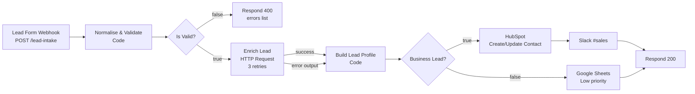

# 01 - Lead Intake, Enrichment & CRM Routing

**Business case:** a website contact form generates leads of very different quality. Sales wants only real business leads in HubSpot and in Slack, while personal-email sign-ups should be kept (for nurturing) but out of the way. Nobody wants to do that triage by hand.

**What this workflow does:** receives the form POST, cleans and validates the payload, enriches the lead with a third-party API, decides whether it is a business lead, and routes it to HubSpot + Slack `#sales` or to a "Low priority" Google Sheet. The form always gets a proper HTTP response (200 or 400).

Canvas screenshot: TODO after import

## Flow



## Trigger

`POST https://<your-n8n>/webhook/lead-intake` with a JSON body:

```json
{
  "name": "Jane Doe",
  "email": "Jane@Acme.com ",
  "company": "Acme Inc",
  "message": "We need help automating our onboarding.",
  "source": "pricing-page"
}
```

The Webhook node runs in *Using Respond to Webhook node* mode, so the HTTP status and body are controlled by the two Respond nodes at the end of each branch.

## Node-by-node

| # | Node | Type | What it does |
|---|------|------|--------------|
| 1 | Lead Form Webhook | `webhook` v2 | Accepts the POST. Path `lead-intake`, response delegated to Respond nodes. |
| 2 | Normalise & Validate | `code` v2 | Trims strings, lower-cases the e-mail, splits `name` into first/last, validates the e-mail with a regex, extracts the domain, flags free-mail domains (gmail, hotmail, yahoo, icloud...). Emits `valid` + `errors[]`. |
| 3 | Is Valid? | `if` v2.2 | Boolean check on `valid`. |
| 4 | Respond 400 (Reject) | `respondToWebhook` v1.1 | Returns `{ "status": "rejected", "errors": [...] }` with HTTP 400. |
| 5 | Enrich Lead | `httpRequest` v4.2 | `GET https://api.example-enrichment.com/v1/person?email=...` with **Header Auth** from a named credential. Retries 3x (1 s apart). `On Error` is set to *continue (error output)* so a vendor outage does not drop the lead. |
| 6 | Build Lead Profile | `code` v2 (per item) | Merges the normalised lead (`$('Normalise & Validate').item.json`) with the enrichment response (or an `unavailable` block if the API failed). Computes `isBusiness` = not a free-mail domain **or** company size >= 10. Sets `route`. |
| 7 | Business Lead? | `if` v2.2 | Boolean check on `isBusiness`. |
| 8 | HubSpot: Create/Update Contact | `hubspot` v2.1 | Contact upsert keyed by e-mail; fills first/last name, company, website, message, lead status `NEW`. |
| 9 | Slack: Notify #sales | `slack` v2.2 | Posts a formatted lead summary (name, e-mail, company, size, industry, message excerpt, enrichment status). |
| 10 | Google Sheets: Low Priority | `googleSheets` v4.5 | Appends the lead to the `Low priority` sheet with explicit column mapping. |
| 11 | Respond 200 | `respondToWebhook` v1.1 | Returns `{ "status": "accepted", "email": ..., "route": "crm" \| "low-priority-sheet" }`. |

Sticky notes on the canvas document the four sections (Intake, Validation, Enrichment, Routing).

## Required credentials

Credentials are referenced **by name only**; create them in your n8n instance before activating the workflow.

| Credential name | Type | Used by |
|-----------------|------|---------|
| `Enrichment API (Header Auth)` | Header Auth (e.g. `Authorization: Bearer <key>`) | Enrich Lead |
| `HubSpot (Private App Token)` | HubSpot App Token | HubSpot: Create/Update Contact |
| `Slack Bot Token` | Slack API (bot token with `chat:write`) | Slack: Notify #sales |
| `Google Sheets (OAuth2)` | Google Sheets OAuth2 | Google Sheets: Low Priority |

Also replace `PLACEHOLDER_SPREADSHEET_ID` in the Google Sheets node and adapt the response-shape mapping in *Build Lead Profile* to your enrichment vendor (Clearbit, Apollo, People Data Labs... all return slightly different JSON).

## How to test

1. Import the workflow, set the credentials, click **Listen for test event** on the webhook (or activate the workflow and use the production URL).
2. Valid business lead:

```bash
curl -X POST "https://<your-n8n>/webhook-test/lead-intake" \
  -H "Content-Type: application/json" \
  -d '{"name":"  Jane Doe ","email":"Jane@Acme.com","company":"Acme Inc","message":"Need help automating onboarding","source":"pricing-page"}'
# -> 200 {"status":"accepted","email":"jane@acme.com","route":"crm"}
```

3. Personal-domain lead (goes to the sheet):

```bash
curl -X POST "https://<your-n8n>/webhook-test/lead-intake" \
  -H "Content-Type: application/json" \
  -d '{"name":"John","email":"john.doe@gmail.com","message":"hi"}'
# -> 200 {"status":"accepted","email":"john.doe@gmail.com","route":"low-priority-sheet"}
```

4. Invalid payload:

```bash
curl -X POST "https://<your-n8n>/webhook-test/lead-intake" \
  -H "Content-Type: application/json" \
  -d '{"name":"","email":"not-an-email"}'
# -> 400 {"status":"rejected","errors":["name is required","email format is invalid"]}
```

## Error handling notes

- **Bad input never reaches external APIs.** Validation happens first and answers 400 with actionable messages.
- **Enrichment outage is non-fatal.** The HTTP node retries 3 times, then routes to its error output; the lead continues with `enrichment.status = "unavailable"` and is still routed (by domain only).
- **CRM / Slack / Sheets failures** stop the execution and are visible in the n8n execution log. Recommended: attach an *Error Workflow* (Workflow settings → Error workflow) that posts to `#ops` so failed leads are re-driven, and enable *Save failed executions*.
- **Idempotency:** HubSpot upsert is keyed by e-mail, so re-sending the same lead updates instead of duplicating.
- **Timeouts:** the enrichment call has a 10 s timeout so a slow vendor cannot make the form hang indefinitely.
