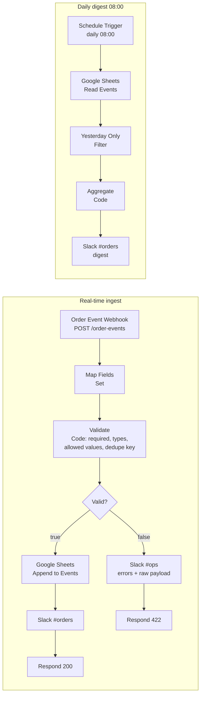

# 02 - Webhook Validation → Google Sheets + Slack (with Daily Digest)

**Business case:** an external system (payment provider, storefront, internal app) pushes *order events* to you. You want every valid event stored in a spreadsheet the team already uses, a short Slack ping per event, an immediate alert to ops when the sender delivers garbage, and a morning summary so nobody has to open the sheet to know how yesterday went.

**What this workflow does:** two triggers in one workflow.

1. **Real-time path** - Webhook → Set (field mapping) → Code (validation + dedupe) → IF. Valid events are appended to Google Sheets and announced in Slack `#orders` (HTTP 200); invalid events alert Slack `#ops` with the error list and raw payload (HTTP 422).
2. **Daily digest path** - Schedule Trigger at 08:00 → read the sheet → keep yesterday's rows → aggregate → post the summary to Slack.

Canvas screenshot: TODO after import

## Flow



## Triggers

- `POST https://<your-n8n>/webhook/order-events` - JSON body, e.g.

```json
{
  "event_id": "evt_10234",
  "source": "shopify",
  "customer_email": "Buyer@Example.com",
  "amount": 149.9,
  "currency": "usd",
  "status": "paid"
}
```

- Schedule Trigger: every day at 08:00 (instance timezone; set `Workflow settings → Timezone` if it differs from the server).

## Node-by-node

### Real-time path

| # | Node | Type | What it does |
|---|------|------|--------------|
| 1 | Order Event Webhook | `webhook` v2 | Accepts the POST on `order-events`; response handled by Respond nodes. |
| 2 | Map Fields | `set` v3.4 | Picks `event_id`, `source`, `customer_email`, `amount`, `currency`, `status` out of the body (with fallbacks such as `id` → `event_id`, `x-source` header → `source`), normalises case, stamps `received_at`, keeps the raw body in `raw`. Decouples the rest of the flow from the sender's payload shape. |
| 3 | Validate | `code` v2 | Required fields, `amount` is a non-negative number, e-mail regex, `status` and `currency` in allow-lists. Builds `dedupe_key = source:event_id` and rejects keys already present in the workflow static data (`$getWorkflowStaticData('global').seenKeys`, capped at 5 000 entries). Emits `valid` + `errors[]`. |
| 4 | Valid? | `if` v2.2 | Boolean check on `valid`. |
| 5 | Google Sheets: Append Event | `googleSheets` v4.5 | Appends one row to sheet `Events` with explicit column mapping (`received_at, event_id, source, customer_email, amount, currency, status, dedupe_key`). |
| 6 | Slack: Notify #orders | `slack` v2.2 | One-line confirmation per event. |
| 7 | Respond 200 | `respondToWebhook` v1.1 | `{ "status": "accepted", "event_id": ..., "dedupe_key": ... }`. |
| 8 | Slack: Alert #ops | `slack` v2.2 | Bullet list of validation errors + the raw payload (truncated to 1 500 chars) so ops can see exactly what the sender delivered. |
| 9 | Respond 422 | `respondToWebhook` v1.1 | `{ "status": "rejected", "errors": [...] }` with HTTP 422 so the sender can fix their integration. |

### Daily digest path

| # | Node | Type | What it does |
|---|------|------|--------------|
| 10 | Daily 08:00 | `scheduleTrigger` v1.2 | Fires once a day at 08:00. |
| 11 | Google Sheets: Read Events | `googleSheets` v4.5 | Reads all rows from `Events`. (For large sheets add a `received_at` filter in the node options or move to a database.) |
| 12 | Yesterday Only | `filter` v2.2 | Keeps rows whose `received_at` starts with yesterday's `yyyy-MM-dd`. *Always Output Data* is on so the digest still runs on an empty day. |
| 13 | Aggregate | `code` v2 | Counts events, sums `amount` for `paid` events, and builds breakdowns by `source` and `status`. |
| 14 | Slack: Post Digest | `slack` v2.2 | Posts the summary to `#orders`. |

## Required credentials

| Credential name | Type | Used by |
|-----------------|------|---------|
| `Google Sheets (OAuth2)` | Google Sheets OAuth2 | Append Event, Read Events |
| `Slack Bot Token` | Slack API (bot token with `chat:write`) | all Slack nodes |

Replace `PLACEHOLDER_SPREADSHEET_ID` in both Google Sheets nodes and create a sheet named `Events` whose first row has the column headers listed above.

## How to test

```bash
# valid event -> 200, row appended, Slack #orders message
curl -X POST "https://<your-n8n>/webhook-test/order-events" \
  -H "Content-Type: application/json" \
  -d '{"event_id":"evt_10234","source":"shopify","customer_email":"Buyer@Example.com","amount":149.9,"currency":"usd","status":"paid"}'

# invalid event -> 422, Slack #ops alert, nothing stored
curl -X POST "https://<your-n8n>/webhook-test/order-events" \
  -H "Content-Type: application/json" \
  -d '{"event_id":"evt_10235","source":"shopify","customer_email":"nope","amount":"12","status":"shipped"}'
# -> {"status":"rejected","errors":["currency is required","amount must be a number","customer_email is not a valid e-mail","status must be one of created, paid, refunded, cancelled"]}
```

Note: `currency` defaults to `USD` in *Map Fields* when missing, so the second example actually reports the other three errors; remove the fallback if you want it strictly required.

To test the digest, open the *Daily 08:00* node and click **Execute step** (or run the whole workflow manually - both triggers run in a manual execution).

## Error handling notes

- **Validation before persistence.** Nothing invalid ever reaches the sheet; the sender gets a machine-readable 422 and ops gets the raw payload.
- **Dedupe is best-effort.** `$getWorkflowStaticData` persists only for *production* executions (not manual test runs) and is per-workflow; for hard guarantees use the `dedupe_key` column as a unique key in a database, or switch the Sheets node to *append or update* matching on `dedupe_key`.
- **Google Sheets rate limits.** Sheets allows ~60 writes/min per user; if the sender bursts, put a queue (Redis / RabbitMQ) or the n8n *Loop Over Items* node with a *Wait* in front of the append.
- **Slack failures** stop the branch after the row was saved; the sender then receives no response and n8n returns a 500. Attach an *Error Workflow* and enable *Save failed executions* so the event can be re-driven from the execution log.
- **Empty digest day.** Handled explicitly via *Always Output Data* on the Filter plus a guard in *Aggregate*.
