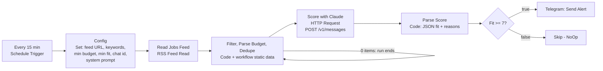

# 03 - Upwork Job Monitor (RSS → Claude fit score → Telegram)

**This is the dogfooding workflow.** It is the freelancer's own client-acquisition automation: instead of refreshing a job board, a scheduled n8n workflow polls a job feed every 15 minutes, discards anything that is not about n8n / automation / AI agents, asks Claude how well each remaining post fits the freelancer's profile, and pushes the good ones (fit >= 7) to Telegram with the budget, the score, two reasons and the link. The same pattern - *poll → cheap filter → LLM judgement → human notification* - applies to lead lists, RFPs, tender portals, support tickets or any stream where a person should only see the 5 % that matter.

> **Feed source note.** The feed URL in the `Config` node is a placeholder. Upwork's RSS availability has varied over time (it has been restricted, then partially restored, and depends on the account/search). The actual source will be confirmed in a later phase; alternatives include third-party feed providers such as Vollna, a saved-search e-mail digest parsed by n8n, or a scraper behind your own RSS endpoint. Any RSS/Atom feed with `title`, `link`, `content`/`description` and `guid` works without changing the workflow.

Canvas screenshot: TODO after import

## Flow



## Trigger

Schedule Trigger, every 15 minutes. Nothing else is needed; the run is fully unattended.

## Node-by-node

| # | Node | Type | What it does |
|---|------|------|--------------|
| 1 | Every 15 min | `scheduleTrigger` v1.2 | Polling cadence. |
| 2 | Config | `set` v3.4 | Single place for tunables: `feedUrl` (placeholder), `keywords` (`n8n, automation, make.com, ai agent, rag, workflow, zapier`), `minBudget` (300), `minFit` (7), `telegramChatId`, and the `systemPrompt` with the freelancer profile ("n8n / AI automation engineer, Python/TypeScript, 6+ yrs backend") plus the instruction to answer with JSON `{ "fit": 1-10, "reasons": [...] }`. If your instance allows `$env` in expressions you can set `feedUrl` to `{{ $env.JOBS_FEED_URL }}` instead. |
| 3 | Read Jobs Feed | `rssFeedRead` v1 | Fetches the feed from `{{ $json.feedUrl }}`. Retries 3x with 2 s back-off. |
| 4 | Filter, Parse Budget, Dedupe | `code` v2 | Strips HTML, keyword-matches title + description, parses `Budget: $500` / `Hourly Range: $30-$50` into `{ type, min, max, label }`, drops jobs under `minBudget` (hourly jobs compared as max rate x 10 h; unknown budgets pass), and dedupes with `$getWorkflowStaticData('global').seenGuids` (last 2 000 GUIDs). Every GUID is marked seen whether or not it matched, so a post is never re-evaluated. Builds `promptText` for the LLM. Outputs 0 items when nothing new matched, which ends the run. |
| 5 | Score with Claude | `httpRequest` v4.2 | `POST https://api.anthropic.com/v1/messages` with headers `x-api-key` (from the Header Auth credential) and `anthropic-version: 2023-06-01`; body `{ model: "claude-opus-5", max_tokens: 1024, system: <profile prompt>, messages: [{ role: "user", content: promptText }] }`. 60 s timeout, 2 retries, *continue on error* so a single failed call does not abort the batch. |
| 6 | Parse Score | `code` v2 (per item) | Takes the first `text` content block, strips code fences, extracts the outermost `{...}`, `JSON.parse`s it, clamps `fit` to 0-10 and keeps up to 5 reasons. On API error or parse failure: `fit = 0`, `scoringError` set, reasons `["parse_error"]`. Merges everything back onto the job item and keeps `usage` for cost tracking. |
| 7 | Fit >= 7? | `if` v2.2 | Numeric compare `fit >= Config.minFit`. |
| 8 | Telegram: Send Alert | `telegram` v1.2 | Markdown message: title, budget label, fit score, first 2 reasons, matched keywords, link. Markdown-sensitive characters are stripped from the model output so the message never fails to render. |
| 9 | Skip (low fit) | `noOp` v1 | Explicit sink for rejected jobs (keeps the canvas self-explanatory). |

## Required credentials

| Credential name | Type | Used by |
|-----------------|------|---------|
| `Anthropic API (x-api-key header)` | Header Auth - name `x-api-key`, value your Anthropic API key | Score with Claude |
| `Telegram Bot` | Telegram API (bot token from @BotFather) | Telegram: Send Alert |

Set `telegramChatId` in `Config` to your chat/group id (send the bot a message and read it from `getUpdates`, or use the n8n Telegram Trigger once).

## How to test

There is no webhook; test by executing the workflow manually in the editor. To try it without a live feed:

1. Import the workflow and set the two credentials.
2. Pin sample data on **Read Jobs Feed** (open the node → *Pin data*) such as:

```json
[
  {
    "title": "Build an n8n workflow to sync HubSpot leads to Slack",
    "link": "https://jobs.example.com/jobs/~0123456789",
    "guid": "https://jobs.example.com/jobs/~0123456789",
    "isoDate": "2026-09-10T12:00:00Z",
    "content": "We need an automation engineer to build a workflow... <b>Budget</b>: $1,200<br /><b>Skills</b>: n8n, Zapier, API"
  }
]
```

3. Click **Execute workflow**. You should see one item leave *Filter, Parse Budget, Dedupe*, a scored item after *Parse Score*, and a Telegram message if the fit is >= 7.

Equivalent curl to check the Claude call outside n8n (replace the key):

```bash
curl https://api.anthropic.com/v1/messages \
  -H "x-api-key: $ANTHROPIC_API_KEY" \
  -H "anthropic-version: 2023-06-01" \
  -H "content-type: application/json" \
  -d '{
    "model": "claude-opus-5",
    "max_tokens": 1024,
    "system": "You are screening freelance job posts... respond with ONLY JSON {\"fit\": 1-10, \"reasons\": [...]}",
    "messages": [{"role": "user", "content": "Job title: Build an n8n workflow...\nBudget: $1200 fixed\n\nDescription: ..."}]
  }'
```

Note: `$getWorkflowStaticData` only persists between *production* executions; in manual runs the dedupe set starts empty each time, which is convenient for testing.

## Error handling notes

- **Feed down:** RSS node retries 3x; if it still fails the execution errors and is visible in the log - the next 15-minute run simply tries again, no state is lost.
- **LLM errors are per-item, not per-run:** the HTTP node continues on error; *Parse Score* turns any error or non-JSON answer into `fit = 0` with `scoringError`, so a flaky call never blocks the other jobs and never triggers a false alert.
- **Cost control:** only keyword-matched, budget-qualified, never-seen posts reach the API. With a typical feed this is a handful of calls per hour. `usage` is kept on each item if you want to log token spend to a sheet. If you want to reduce spend further, add `"output_config": { "effort": "low" }` to the request body - the task is simple classification.
- **Dedupe memory:** capped at 2 000 GUIDs to keep workflow static data small.
- **Telegram Markdown:** model-generated text is sanitised before sending; if you switch to `MarkdownV2` escape the reserved characters instead.
- Recommended: set an *Error Workflow* that notifies you on Telegram when this workflow itself fails, so a silent feed change does not go unnoticed for days.
